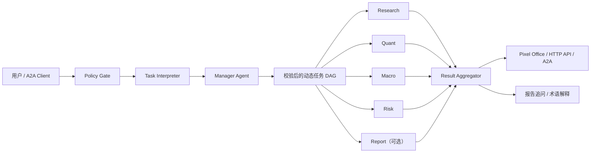

<div align="center">

# AlphaBit Coach

**一支看得见的 AI 投研团队，一位帮助你学会研究的金融教练。**

🏆 AdventureX 2026 · PandaAI「交易未来」赛道冠军

[在线体验](http://118.178.136.23:8000/office) · [API 文档](http://118.178.136.23:8000/docs) · [Agent Card](http://118.178.136.23:8000/.well-known/agent-card.json) · [PandaAI 提交说明](./README_PANDAAI.md)


</div>

AlphaBit Coach 是一个面向投资研究与学习的多智能体平台。它不会把问题塞进固定 Agent 流程，而是由 **Manager Agent 根据当前目标动态组建专家团队、生成任务 DAG**；前端实时展示专家分工、依赖关系、执行日志和 Skill 调用；最终结果只根据真实返回的证据生成。

它想解决的不只是“给出一个答案”，而是让用户看见：**答案由谁完成、依据是什么、哪里存在冲突、哪些结论仍未验证。**

> AlphaBit Coach 仅用于投资研究学习和技术演示，不构成投资建议、证券推荐、收益承诺或交易指令。

## 为什么是 AlphaBit Coach

| 常见 AI 投研体验 | AlphaBit Coach |
| --- | --- |
| 黑盒输出一段结论 | Pixel Office、任务 DAG、SSE 日志实时展示研究过程 |
| 固定工作流调用所有 Agent | Manager 按问题动态选择最小充分专家集合 |
| 模型自行补齐缺失信息 | 缺失数据、失败步骤和未验证假设被明确保留 |
| 结果面向专业用户堆砌术语 | 通俗结论与专业证据视图共享同一份后端事实 |
| 用户只能接受答案 | 支持报告追问、术语解释和知识水平适配 |

## 在线体验

| 入口 | 地址 | 用途 |
| --- | --- | --- |
| AlphaBit Office | [打开产品](http://118.178.136.23:8000/office) | Pixel Office、动态任务图、实时执行和报告页 |
| OpenAPI | [打开文档](http://118.178.136.23:8000/docs) | 查看和调试 HTTP API |
| A2A Agent Card | [查看能力声明](http://118.178.136.23:8000/.well-known/agent-card.json) | 发现协议、能力和调用入口 |

在线服务用于项目演示；若服务暂时不可用，可按下方步骤在本地运行。无外部凭据时，可切换到明确标注的“产品演示”模式体验完整交互。

## 核心能力

- **动态专家组队**：从 `research`、`quant`、`macro`、`risk`、`report` 中选择与当前问题匹配的专家，并生成有依赖关系的任务 DAG。
- **可观测协作**：Pixel Office 展示 Agent 状态，SSE 持续推送计划、步骤和 Skill 生命周期事件。
- **证据约束结果**：`ResultAggregator` 只读取实际 `ExpertResult`，保留数据来源、验证状态、冲突、假设和局限。
- **专家自主管理 Skill**：Manager 只决定专家与依赖；每个专家只能在自己的 allowlist 内选择 Skill。
- **受控真实数据**：市场、公司、宏观和事件数据统一通过 PandaData 适配层访问；数据不可用时显式失败。
- **分层学习体验**：提供通俗/专业双视图、报告证据追问、术语解释和用户知识水平适配。
- **A2A 互操作**：提供 Agent Card、JSON-RPC `message/send` 与 `tasks/get`。

## 工作原理



系统遵守四条关键边界：

1. **Manager 只规划专家协作**，不能直接选择或调用底层 Skill。
2. **模型生成的计划不直接执行**，必须先通过 Pydantic 契约、依赖图和策略校验。
3. **WorkflowExecutor 严格执行已校验 DAG**，不会在运行时偷偷追加 Agent。
4. **ResultAggregator 只聚合真实结果**，不会用模型内容补齐失败步骤或缺失证据。

### 专家团队

| Expert | 主要职责 |
| --- | --- |
| `research` | 市场表现、公司财报、基本面和行业研究 |
| `quant` | 历史量化交叉验证、因子假设和 R020 计算 |
| `macro` | 宏观、政策、周期、利率和流动性研究 |
| `risk` | 独立风险审查与事件风险扫描 |
| `report` | 按声明的上游依赖整合正式报告；不是默认必经节点 |

### 受控 Skill Runtime

`backend/skills/skill_registry.py` 是运行时唯一 Skill allowlist：

| Skill | Owner | 用途 | 结果边界 |
| --- | --- | --- | --- |
| `factor_idea_generation` | `quant` | 生成结构化因子假设 | `unverified` |
| `r020_volume_expansion` | `quant` | 计算固定 R020 成交量放大因子 | `computed_not_validated` |
| `a_share_stock_dossier` | `research` | A 股单公司财报和基本面尽调 | 不验证未来收益 |
| `macro_monitor` | `macro` | 宏观监控方法与指标选择 | 事实必须来自 PandaData |
| `event_risk_alert` | `risk` | 事件与公告风险扫描 | 事件线索不等于因果结论 |

所有运行时 Skill 都由 [`skills.lock.json`](./skills.lock.json) 固定来源、commit、入口和 SHA-256。Instruction Skill 被视为不可信方法文本：系统只允许有界读取，不会执行 `SKILL.md` 中的命令；Executable Skill 只能加载锁文件声明的入口。

## 快速开始

### 1. 本地启动

推荐使用 Python 3.11。

```powershell
git clone https://github.com/Alia0415/AlphaBit-Coach.git
cd AlphaBit-Coach

python -m venv .venv
.\.venv\Scripts\Activate.ps1
python -m pip install -r requirements.txt

uvicorn backend.main:app --reload
```

macOS / Linux 激活虚拟环境时使用：

```bash
source .venv/bin/activate
```

启动后访问：

- 产品界面：<http://127.0.0.1:8000/office>
- API 文档：<http://127.0.0.1:8000/docs>
- 健康检查：<http://127.0.0.1:8000/api/health>

不配置任何外部凭据也可以使用“产品演示”模式；该模式只使用明确标注的本地示例数据，不会调用模型或真实数据源。

### 2. 启用实时研究

在仓库根目录创建 `.env`：

```dotenv
# 实时规划、分析与报告追问
DEEPSEEK_API_KEY=your-deepseek-key
DEEPSEEK_BASE_URL=https://api.deepseek.com
DEEPSEEK_MODEL=deepseek-v4-flash

# 需要真实市场、财务或宏观数据时配置
PANDADATA_USERNAME=86xxxxxxxxxxx
PANDADATA_PASSWORD=your-pandadata-password
```

如需完整的外部 Skill 能力，安装 [`skills.lock.json`](./skills.lock.json) 中固定并校验的版本：

```powershell
python scripts\install_selected_skills.py
```

Macro Monitor 与 Event Risk Alert 的审查快照已随仓库提供；启动时只会从这些固定快照补齐缺失目录，不会下载或覆盖已有运行时目录。可通过 `QUANTSKILLS_HOME` 指定其他绝对路径。

### 3. Docker

```bash
docker build -t alphabit-coach .
docker run --rm -p 8000:8000 --env-file .env alphabit-coach
```

仅体验演示模式时可省略 `--env-file .env`。

## 试一个研究任务

在 AlphaBit Office 中输入：

```text
请对贵州茅台（600519.SH）做一份综合研究：
分析近期市场表现、公司财务质量、宏观消费环境和重大事件风险，
整合支持与反对证据，并明确研究局限。不要提供买卖建议。
```

系统会在必要时先澄清研究口径，再动态组建至少两个不同专家、生成跨专家依赖并执行研究。任务结构取决于当前问题，不是固定 Agent 顺序。

也可以直接调用 API：

```bash
curl -X POST "http://127.0.0.1:8000/api/plan" \
  -H "Content-Type: application/json" \
  -d '{"prompt":"分析 600519.SH 的市场表现、财务质量和主要风险，不要提供买卖建议。"}'
```

### 常用接口

| Method | Path | 说明 |
| --- | --- | --- |
| `POST` | `/api/plan` | 生成并校验专家 DAG，不执行任务 |
| `POST` | `/api/tasks/sessions` | 创建支持澄清与流式执行的研究会话 |
| `GET` | `/api/tasks/{task_id}/stream` | 订阅任务与 Skill 生命周期事件 |
| `POST` | `/api/tasks` | 同步执行完整研究任务 |
| `GET` | `/api/reports/{report_id}` | 获取已完成报告与证据 |
| `POST` | `/api/reports/{report_id}/coach` | 基于报告证据进行追问 |
| `GET` | `/.well-known/agent-card.json` | 获取 A2A Agent Card |
| `POST` | `/a2a` | A2A JSON-RPC 入口 |

如果设置了 `ALPHAOS_A2A_TOKEN`，A2A 请求必须携带对应的 `Authorization: Bearer ...`；未设置时，本地 A2A 入口不要求 token。

## 当前完成度

### 已实现

- Research、Quant、Macro、Risk、Report 的动态选择与 DAG 执行
- Pixel Office、Agent 状态动画、SSE 日志和 Skill 调用可视化
- PandaData 支持的市场、公司、财务、宏观和事件风险研究
- 因子假设生成与固定 R020 因子计算
- 证据约束聚合、通俗/专业结果视图和完整 provenance
- 用户画像、报告证据追问、术语解释和知识水平适配
- A2A Agent Card、任务提交与任务查询

### 尚未实现 / 明确不支持

- 独立的任务前置金融教练，以及完整的引导提问、错误纠正和研究复盘闭环
- 完整因子回测、多维 IC 诊断和投资组合构建
- 自动交易、账户访问、订单执行、买卖建议、目标价或收益承诺
- 动态执行未知 GitHub 仓库、用户提供的代码或 Skill 文档中的命令
- Coach 加入专家 DAG、触发新研究或绕过报告证据回答

## 测试

自动化测试会 mock DeepSeek 与 PandaData，不消耗真实 API 配额：

```powershell
python -m pytest -q tests
```

需要真实凭据和配额的手动集成测试不会由自动化测试触发：

```powershell
python tests\manual_test_research_dossier.py
python tests\manual_test_quant_runtime.py
python tests\manual_test_macro_agent.py
python tests\manual_test_dynamic_execution.py
```

凭据缺失时，这些脚本会报告 `skipped`，不会用 fixture 冒充真实结果。

## 项目结构

```text
AlphaBit-Coach/
├── backend/              # FastAPI、Agent、工作流、数据服务与 Skill Runtime
├── frontend/             # 零构建步骤的静态 Web UI 与 Pixel Office
├── public/pixel/         # Agent sprite 与场景资源
├── tests/                # 单元、契约、前端与端到端测试
├── scripts/              # Skill 安装、资源处理和手动验证脚本
├── vendor/quantskills/   # 已审查的固定 Skill 快照
├── agent-card.json       # A2A 能力声明模板
└── skills.lock.json      # Runtime Skill 来源、版本与哈希锁定
```

## 安全与研究边界

- 凭据只从环境变量或被 Git 忽略的 `.env` 读取，不进入结果与执行事件。
- 外部数据调用统一经过受控适配层；模型不能自由选择任意方法。
- 因子想法始终标记为 `unverified`；R020 计算始终标记为 `computed_not_validated`。
- 缺失证据、失败步骤和冲突观点会被保留，不会自动包装成确定结论。
- 第三方 QuantSkills 的来源、固定版本和许可证记录在 [`skills.lock.json`](./skills.lock.json) 与 `vendor/` 对应目录中；分发时请保留其许可证与来源声明。

---

如果这个项目对你有帮助，欢迎 Star、提交 Issue，或分享你希望 AI 金融教练帮你拆解的真实研究问题。
