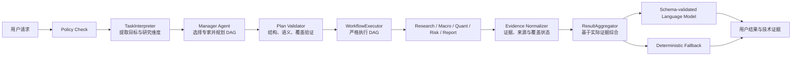
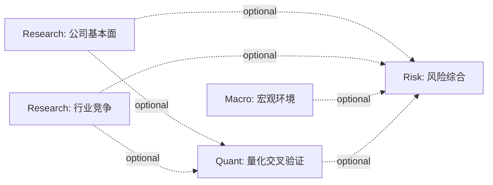

# AlphaOS 多维股票研究与量化决策支持设计

日期：2026-07-25

状态：待用户最终评审

## 1. 背景

AlphaOS 当前具备 `research`、`quant`、`risk`、`macro`、`report`
等专家，但用户输入“分析某只股票”时，系统容易只选择 Research Agent。
这不是单一提示词问题，而是任务语义、计划验证、专家能力边界和结果聚合共同造成的：

1. `TaskSpec` 只描述任务类型，没有表达“基本面、行业、宏观、量化交叉验证、
   风险”等研究维度。Manager 缺少必须覆盖哪些问题的结构化输入。
2. Manager 的输出只验证 DAG 结构和专家输入是否合法，不验证研究维度是否被覆盖，
   也不阻止非必要的 Report Agent。
3. Research 的行业研究在没有真实行业数据时只生成研究框架，却仍以
   `completed` 返回，执行完成与证据充分被混为一谈。
4. Quant 的可见能力集中在因子想法和 R020，用户不要求“做量化”时，
   Manager 很难判断 Quant 对普通投资研究的价值。
5. Macro、Risk 和 Aggregator 对模型调用及上游失败过于敏感。硬依赖会放大单点失败，
   Aggregator 又没有完整使用全部专家证据。

本设计将“多维研究”设为综合股票分析的默认产品语义，同时保留聚焦请求的最小专家选择。
量化能力定位为“用可复现数据证据交叉验证投资逻辑”，而不是生成买卖指令。

## 2. 目标与非目标

### 2.1 目标

- “分析某只股票”“全面研究某公司”等综合请求，默认覆盖公司基本面、行业竞争、
  宏观环境、量化交叉验证和风险评估五个维度。
- “看最近波动”“分析财报”“扫描事件风险”等明确聚焦请求只覆盖必要维度，
  不为了展示多 Agent 而强行扩大 DAG。
- Manager 继续是唯一的专家选择器和 DAG 规划器。
- 所有金融事实和数值只来自 PandaAIQuant/PandaData；模型只负责选择受控数据范围、
  解释结构化证据和组织语言。
- Quant 面向普通投资决策提供相对比较、趋势与风险量化、证据一致性和不确定性，
  不输出交易指令或收益承诺。
- 单个专家或一次模型调用失败时，尽可能返回有来源、明确降级的部分结果。
- 同一任务不因同步重试产生重复执行；完整任务在比赛要求的 20 分钟内结束。

### 2.2 非目标

- 不实现完整回测、IC 检验、组合构建、账户访问或自动交易。
- 不启用 Portfolio Agent。
- 不接入 PandaAIQuant 以外的金融数据、网页事实或模型内生知识作为事实证据。
- 不把 Manager 改造成研究专家，也不让 Executor 或 Aggregator 补选 Agent。
- 不实现固定的 Research → Macro → Quant → Risk → Report 流水线。
- 不因本设计新增未经审核的外部 Runtime Skill。

## 3. 已选方案

考虑过三种方案：

1. **提示词增强**：只要求 Manager “多选几个 Agent”。改动小，但无法区分综合与聚焦请求，
   也不能通过验证器保证覆盖，稳定性最差。
2. **固定股票研究工作流**：股票请求固定执行四到五个 Agent。演示稳定，但违反动态组织架构，
   会让简单请求变慢，并把 Executor 变成第二个规划器。
3. **研究维度驱动的动态 DAG**：TaskInterpreter 提取研究维度，Manager 根据 Registry
   动态选择专家和依赖，Validator 验证维度覆盖，Executor 只执行计划。

采用方案 3。它能把“多维研究”变成可验证的产品契约，同时保留 Manager 的唯一规划权。

## 4. 总体架构



职责不变：

- TaskInterpreter 只理解用户目标，不选择专家。
- Manager 只选择专家、步骤和依赖，不选择专家内部 Skill 或 PandaData 方法。
- Expert 只执行授权范围内的分析，并自行选择受控 Skill 或数据。
- Executor 不增加、删除或重排业务步骤。
- Aggregator 不补选专家、不改变 DAG，只使用实际 `ExpertResult`。
- 前端只渲染 `AggregationResult`，不生成研究结论。

## 5. 任务语义契约

### 5.1 ResearchDimension

新增受控枚举：

```python
ResearchDimension = Literal[
    "company_fundamentals",
    "industry_competition",
    "macro_environment",
    "quantitative_cross_check",
    "risk_assessment",
    "formal_report",
]
```

`TaskSpec` 新增：

```python
request_scope: Literal["focused", "comprehensive"]
required_dimensions: list[ResearchDimension]
optional_dimensions: list[ResearchDimension]
```

约束：

- `required_dimensions` 去重且不可为空。
- `formal_report` 仅在用户明确要求研报、正式报告或导出报告时出现。
- `request_scope="comprehensive"` 的单公司研究默认要求前五个维度。
- 用户明确限定范围时为 `focused`，只保留与目标直接相关的维度。
- Interpreter 可补默认维度，但必须将补充项写入 `defaulted_fields`，供用户查看。
- 维度不是 Agent 名称，Interpreter 提示词和输出中不出现专家候选列表。

### 5.2 综合与聚焦判定

综合请求示例：

- “分析比亚迪”
- “全面研究宁德时代”
- “从基本面、行业和风险角度评估某公司”

这类请求默认产生：

```json
{
  "request_scope": "comprehensive",
  "required_dimensions": [
    "company_fundamentals",
    "industry_competition",
    "macro_environment",
    "quantitative_cross_check",
    "risk_assessment"
  ]
}
```

聚焦请求示例：

- “看比亚迪近三个月波动和回撤”：
  `quantitative_cross_check`
- “分析比亚迪最近三年财务质量”：
  `company_fundamentals`
- “扫描比亚迪近期事件风险”：
  `risk_assessment`
- “生成正式研报”：
  用户要求的研究维度加 `formal_report`

Interpreter 使用模型进行语义判断，不用关键词路由。输出必须通过 Pydantic 校验；
只允许一次 JSON 修复。修复仍失败时，使用保守的确定性默认：
单公司宽泛分析按 comprehensive 处理，边界明确的指标请求按 focused 处理。

## 6. Manager 与计划验证

### 6.1 计划中的维度声明

`PlanStep` 新增：

```python
covers_dimensions: list[ResearchDimension]
dependencies: list[DependencyRef]
```

`DependencyRef`：

```python
class DependencyRef(BaseModel):
    step_id: str
    requirement: Literal["required", "optional"] = "required"
```

迁移期间可读取旧 `depends_on` 并转换为 required 依赖；新计划提示词只输出
`dependencies`。图的拓扑边集合为所有 required 和 optional 依赖。

### 6.2 Registry 能力声明

中央 Agent Registry 为每个已启用专家声明可覆盖的维度：

| Expert | 可覆盖维度 |
| --- | --- |
| Research | `company_fundamentals`, `industry_competition` |
| Macro | `macro_environment` |
| Quant | `quantitative_cross_check` |
| Risk | `risk_assessment` |
| Report | `formal_report` |

这张映射属于 Registry 元数据，不写死在 Manager 提示词、Executor 或 Aggregator。
Manager 提示词始终由启用的 Registry 条目生成，因此 Portfolio 禁用时不会被选择。

### 6.3 语义验证

在现有成员、输入、唯一 ID、最大八步和无环验证之外，增加：

- 每个 `covers_dimensions` 必须属于该 Agent 在 Registry 中声明的能力。
- 所有 required dimensions 必须至少被一个步骤覆盖。
- focused 请求不得添加与 required/optional dimensions 都无关的步骤。
- `formal_report` 不在 TaskSpec 时，拒绝任何 Report 步骤。
- `formal_report` 在 TaskSpec 时，Report 必须依赖至少一个研究证据步骤。
- Manager 不得出现在 `selected_agents` 或步骤中。
- `selected_agents` 仍必须与步骤实际使用的专家集合完全一致。
- 依赖必须有业务意义：Risk 可依赖上游研究证据；Report 可依赖研究结果；
  普通采集步骤不得无理由依赖 Report 或 Risk。

验证失败后只允许一次受控计划修复。第二次失败返回规划失败，不由 Executor 猜测或补计划。

### 6.4 确定性设置

Manager 调用使用稳定的请求配置：

- `temperature=0`
- 固定模型版本和显式 JSON Schema
- 稳定排序的 Registry、TaskSpec 和上下文
- 提示词版本号写入 metadata
- 不传入时间戳、随机 ID 或无关历史文本

模型仍可能存在细微非确定性，因此真正的稳定保证来自 schema 与语义验证，而不是假设
`temperature=0` 等于绝对确定。

## 7. 专家设计

### 7.1 Research Agent

Research 负责两个独立维度，Manager 可以用一个或两个 Research 步骤覆盖：

**公司基本面**

- 延续 `a_share_stock_dossier` 的受控执行。
- 财务报表、业绩、审计、分红、股东与公司事件只通过 `PandaDataClient`。
- 模型只解释 dossier 产生的结构化指标、异常与限制。

**行业竞争**

将当前“定性框架”升级为真实 PandaData 证据分析：

1. 通过 `get_stock_industry` 确定申万行业层级。
2. 通过 `get_stock_competitor` 获取竞品候选。
3. 竞品不足时，通过 `get_industry_constituents` 补充同层级公司。
4. 通过 `get_industry_detail` 获取行业信息；需要概念口径时，只使用受控的
   `get_concept_list` 和 `get_concept_constituents`。
5. 对目标和不超过约定上限的同业，获取可比财务、估值或市场数据。
6. Python 统一口径、处理缺失值并生成排名、分位数和样本覆盖。
7. 模型仅总结竞争位置、优势证据、劣势证据和不可比较项。

若只有框架而没有实际行业或同业数据，步骤可以执行完成，但
`evidence_status` 必须是 `insufficient`，Aggregator 不得把框架呈现为已验证结论。

### 7.2 Quant Agent

Quant 的产品定位是“量化决策支持”，不是“用户必须先提出量化问题”。
当 TaskSpec 包含 `quantitative_cross_check` 时，Manager 可以选择 Quant，
Quant 用数据回答：

- 基本面判断是否得到价格、成交量和相对表现支持。
- 目标公司相对同业或基准处于什么位置。
- 波动、最大回撤、下行波动和流动性是否改变风险判断。
- 不同观察窗口下结论是否敏感。
- Research、Macro 与市场行为之间是否存在一致、冲突或证据不足。
- 当前结论的不确定性来自数据缺失、样本短、异常值还是指标口径。

受控计算首期包括：

- 区间收益与相对基准收益
- 年化波动、下行波动、最大回撤
- 量价趋势、成交量扩张与异常成交
- 20/60/120 日多窗口敏感性
- 目标相对同业的横截面排名和分位数
- 可用时的估值或财务指标历史分位
- 上游结构化结论与量化证据的一致性标签：
  `supports`、`conflicts`、`inconclusive`

每项输出必须包含：公式或方法标识、数据窗口、样本数、结果、比较基准、
方向解释、限制和 evidence ID。

Quant 内部 Skill Planner 保持动态：

- 因子研究目标可选 `factor_idea_generation`。
- 量能扩张证据适用时可选 `r020_volume_expansion`。
- 最多三个内部 Skill 步骤。
- 普通决策交叉验证由 Quant Agent 的受控 Python 计算模块完成，
  不是新增外部 Runtime Skill，也不执行未知仓库代码。

状态边界保持不变：

- 因子想法为 `unverified`。
- R020 为 `computed_not_validated`。
- 横截面排名、回撤或相对收益是历史计算事实，不得表述成 IC、回测绩效或未来收益证据。
- 输出不得包含“买入”“卖出”“目标价”“仓位比例”或收益承诺。

### 7.3 Macro Agent

Macro 仍只使用审核过的 PandaData 宏观类别、目录指标和受控 API。分为四阶段：

1. 根据任务、公司行业和 Registry 能力选择 1-4 个 allowlisted 类别。
2. 从 PandaData catalog 中选择 1-8 个指标。
3. 获取数据并用 Python 计算趋势、变化、拐点、样本覆盖和最新发布日期。
4. 模型基于结构化证据解释传导机制。

稳定降级：

- 类别模型输出无效：一次修复后，使用“通用宏观类别 + PandaData 行业分类到宏观类别”
  的审核映射；不执行模型提供的方法名。
- 指标选择无效：按数据覆盖、最新日期和字段完整度确定性排序，选择前 N 个目录指标。
- 个别指标失败：保留成功指标并标记 partial。
- 解释模型失败：使用 Python 已计算的方向、变化和覆盖生成确定性摘要。
- PandaData 完全不可用：返回 unavailable，不使用模型常识补宏观事实。

类别映射是 Macro 内部的数据治理规则，不是 Manager 的关键词路由。

### 7.4 Risk Agent

Risk 综合两类证据：

- 自有受控 PandaData 事件扫描，例如公告、质押、解禁、股东变化、融资和异常交易。
- 来自 Research、Macro 和 Quant 的实际上游 `ExpertResult`。

Risk 对综合任务通常把上游研究步骤声明为 optional dependency。它等待这些步骤终态后执行，
成功结果用于识别跨维度风险；失败结果被记录为“缺失证据”，不会阻断 Risk 自有扫描。
只有 Risk 明确无法在缺少某个结果时执行的特殊任务，Manager 才声明 required dependency。

Risk 输出风险事实、触发条件、影响路径、证据来源和待核查项，不给交易建议。

### 7.5 Report Agent

Report 仅在 `formal_report` 被明确要求时选择。普通聊天结果由 Aggregator 直接生成，
不需要 Report 来“收尾”。Report 只能格式化和扩展已有证据，不能补事实。

## 8. PandaData 唯一数据边界

`PandaDataClient` 是金融数据唯一入口。新增或补齐的受控方法包括：

- `get_stock_competitor`
- `get_industry_constituents`
- `get_industry_detail`
- `get_concept_list`
- `get_concept_constituents`
- 受控 `get_factor`
- 需要时的指数成分、权重和估值指标方法

每个方法必须：

- 固定调用真实 SDK 方法，不接受任意 method name。
- 校验股票代码、行业级别、日期、字段、页数和最大返回量。
- 返回 `json_safe` 数据。
- 记录 endpoint、参数摘要、时间范围、字段、观测数和错误类型，不记录凭证。
- 在自动化测试中使用 Mock，只有显式 manual integration 脚本消耗真实额度。

每个任务使用 request-scoped data cache，键由 endpoint 与规范化参数组成。
相同步骤或专家请求同一数据时复用结果，减少配额消耗和外部故障面。缓存不跨任务长期保存，
避免陈旧数据成为隐含事实。

模型看到的是有边界的 JSON evidence envelope，不看到 SDK、凭证、任意方法名或未裁剪原始响应。

## 9. 证据契约

### 9.1 执行状态与证据状态分离

`ExpertResult.status` 只表示执行：

- `completed`
- `failed`
- `blocked`

新增：

```python
EvidenceStatus = Literal[
    "sufficient",
    "partial",
    "insufficient",
    "unavailable",
]

EvidenceCoverage = {
    "dimension": ResearchDimension,
    "status": EvidenceStatus,
    "expected_items": int,
    "available_items": int,
    "missing_items": list[str],
}
```

因此，“模型成功生成行业研究框架但没有行业数据”可以是
`status=completed`、`evidence_status=insufficient`。前端和 Aggregator 不再把执行完成率
当成研究质量或证据充分度。

### 9.2 标准证据记录

专家原有 `evidence: list[dict]` 逐步规范为：

```python
class EvidenceRecord(BaseModel):
    evidence_id: str
    dimension: ResearchDimension
    kind: Literal["fact", "metric", "comparison", "judgment", "risk", "limitation"]
    statement: str
    value: Any | None
    unit: str | None
    as_of: str | None
    source: DataProvenance
    method: str | None
    validation_status: ValidationStatus
```

`evidence_id` 由 task ID、step ID 和步骤内稳定序号组成。模型不能创建 evidence ID。
`DataProvenance` 至少记录 PandaData endpoint、标的、窗口、字段和观测数。

## 10. 依赖执行与部分成功

Executor 对每个步骤：

1. 等待所有 required 和 optional 依赖进入终态。
2. 任一 required 依赖不是 completed，则当前步骤 blocked。
3. optional 依赖失败或 blocked 时，当前步骤仍执行，并收到对应 `ExpertResult`。
4. 专家必须在 limitations 或 missing evidence 中说明缺失的 optional 证据。

这仍然是严格执行 Manager DAG：Executor 只解释 Manager 声明的依赖强度，不新增边或步骤。

典型综合研究可以由 Manager 动态生成如下结构，但这不是固定模板：



如果任务只问历史波动，Manager 可以只生成一个 Quant 步骤。

## 11. Ark 调用稳定性

`ArkClient` 从单一 `chat(prompt)` 升级为显式请求契约：

```python
chat_text(request: ArkTextRequest) -> ArkResponse
chat_json(request: ArkJsonRequest[T]) -> T
```

请求配置包含：

- 模型、温度、超时、最大输出长度
- prompt purpose 和 prompt version
- 可选 JSON Schema
- execution ID、step ID 和 attempt

错误使用稳定的内部分类，不向用户泄露原始响应或凭证：

- `configuration`
- `timeout`
- `connection`
- `rate_limit`
- `server`
- `invalid_response`
- `schema_validation`
- `content_empty`

重试策略：

- 只对 timeout、connection、429 和 5xx 做最多两次传输重试。
- 4xx 参数错误、空内容和 schema 错误不做传输重试。
- JSON/schema 错误只允许一次带验证错误摘要的模型修复。
- 使用短指数退避加随机抖动；总时限不得超过当前阶段预算。
- 每个调用记录 attempt、duration、error stage 和最终状态，不记录 prompt 中的敏感原始数据。

结构化输出优先使用 Ark 兼容的 JSON Schema 响应格式。若目标模型不支持，
回退到严格 JSON 提示词加本地 Pydantic 校验，但安全边界和一次修复规则不变。

## 12. 任务幂等性与时间预算

### 12.1 幂等执行

每次任务创建一个稳定 `execution_id`。API 接受可选 idempotency key；未提供时，
由持久化 task ID 作为执行键。

TaskSession 状态转换为：

```text
created → planning → executing → aggregating → completed|partially_completed|failed
```

规则：

- 同一 execution ID 只能有一个 owner 启动规划和执行。
- 并发或同步重试读取现有 session 和事件流，不创建第二套步骤。
- 每个 `(execution_id, step_id)` 只允许一个 active attempt。
- 仅显式的恢复操作可为失败步骤增加 attempt number；恢复仍使用原 step ID。
- 事件以 `(execution_id, sequence)` 唯一，前端重连按 sequence 续传。

### 12.2 20 分钟边界

系统设置 20 分钟硬截止时间，并为阶段设置软预算。具体秒数进入可配置项而不是散落常量：

- 规划和一次修复
- 专家执行
- 聚合和一次修复
- 持久化与响应

每次外部调用开始前检查剩余预算；无法在预算内安全重试时立即降级或失败。
到硬截止时间，停止启动新调用，保留已完成证据，标记未完成步骤，并生成部分结果。
性能优化不是本轮核心，但不会允许无限等待。

## 13. 结果聚合与模型语言

### 13.1 聚合输入

Aggregator 接收：

- 原始用户目标和 `TaskSpec`
- 已验证 `ExecutionPlan`
- 全部实际 `ExpertResult`
- 每个 required dimension 的 evidence coverage

它先用确定性代码建立 `EvidenceBundle`：

- 按维度归组所有 evidence records
- 记录成功、失败、blocked 和缺失维度
- 提取明确冲突
- 生成可引用 evidence ID allowlist
- 限制输入大小并稳定排序

不得只读取某个 profile summary，也不得只存 headline 和 explanation。

### 13.2 模型输出契约

模型可以组织语言和结构化输出，但必须返回 Pydantic `SynthesisDraft`：

```python
class SynthesisClaim(BaseModel):
    text: str
    evidence_ids: list[str]
    claim_type: Literal["finding", "risk", "limitation", "uncertainty"]

class DimensionSynthesis(BaseModel):
    dimension: ResearchDimension
    conclusion: str
    evidence_status: EvidenceStatus
    claims: list[SynthesisClaim]

class SynthesisDraft(BaseModel):
    headline: str
    overall_stance: Literal[
        "positive", "cautiously_positive", "neutral", "mixed",
        "cautiously_negative", "negative", "insufficient_evidence"
    ]
    confidence: Literal["high", "medium", "low"]
    thesis: str
    dimensions: list[DimensionSynthesis]
    conflicts: list[SynthesisClaim]
    uncertainties: list[SynthesisClaim]
    next_research_steps: list[str]
```

本地验证规则：

- 所有事实、指标、比较和风险 claim 至少引用一个现存 evidence ID。
- 模型引用的 ID 必须属于输入 allowlist。
- 没有 sufficient/partial evidence 的维度只能输出限制或不确定性。
- 模型不能新增数字；输出数字必须能在被引用 evidence 中匹配。
- 不得输出交易指令、目标价、仓位或收益承诺。
- required dimension 必须在 dimensions 中出现，即使结论是证据不足。

首次输出失败后只做一次修复。再次失败则由确定性 Aggregator 按维度拼装：

- headline 说明完成或部分完成
- 每个维度展示最高优先级的已验证 evidence
- 冲突和缺失证据单列
- confidence 根据 coverage 和失败情况规则化计算

### 13.3 持久化

任务和报告持久化完整 `AggregationResult`，包括：

- `direct_answer`
- `key_findings`
- `risks`
- `limitations`
- `data_scope`
- `content_blocks`
- `technical_evidence`

列表页可单独派生 headline，但不得用 headline 覆盖完整结果。后续问答只能读取持久化证据，
不能从被截断的 summary 重建事实。

## 14. 错误与降级矩阵

| 故障 | 行为 | 用户结果 |
| --- | --- | --- |
| Interpreter JSON 无效 | 一次修复，之后保守默认或澄清 | 明示使用的默认 |
| Manager 计划无效 | 一次修复，仍无效则停止 | 规划失败，不伪造 DAG |
| 单个 PandaData endpoint 失败 | 保留同步骤其他成功数据 | partial evidence |
| PandaData 对某维度完全不可用 | 专家 unavailable/failed | 其他可执行步骤继续 |
| Macro 选择模型失败 | 审核映射与目录排序降级 | 说明确定性降级 |
| Macro/Research 解释模型失败 | Python 证据摘要 | 不丢弃已取数据 |
| optional 上游失败 | 下游继续，注入失败结果 | 缺失证据显式展示 |
| required 上游失败 | 下游 blocked | 展示阻断原因 |
| Aggregator 模型失败 | 一次修复后确定性聚合 | 有证据的部分结果 |
| 达到任务硬截止时间 | 不启动新调用，结束在途阶段 | partially completed |

## 15. 测试设计

所有自动化测试 Mock ArkClient 和 PandaDataClient，不消耗真实配额。

### 15.1 TaskInterpreter

- 宽泛单公司请求生成 comprehensive 与五个 required dimensions。
- 明确波动请求只生成 quantitative cross-check。
- 正式报告仅在明确要求时出现。
- 模型无效 JSON 经一次修复；第二次失败走保守默认。

### 15.2 Manager 与 Validator

- comprehensive 计划缺任一 required dimension 时拒绝。
- focused 计划加入无关 Agent 时拒绝。
- 未请求 formal report 时拒绝 Report。
- Agent 只能声明 Registry 授权维度。
- required/optional 依赖都参与无环、未知节点和自依赖验证。
- Manager 不能选择 Skill 或 PandaData 方法。
- 相同稳定输入产生相同规范化 prompt 和可验证计划。

### 15.3 PandaData 与 Research

- 新增 endpoint 的参数、字段、范围、行业级别和最大样本校验。
- 行业与竞争分析只使用 Mock PandaData 返回值。
- 竞品不足时使用行业成分回退。
- 没有真实数据的行业框架标记 insufficient，不算已验证行业结论。
- data source 和 evidence ID 完整且不含凭证。

### 15.4 Quant

- 收益、相对收益、波动、下行波动和最大回撤的固定样本单元测试。
- 多窗口敏感性和横截面排名处理缺失值、并列值和短样本。
- supports/conflicts/inconclusive 只基于结构化输入。
- Skill Planner 仍只选择启用且归 Quant 所有的 Skill，最多三步。
- 输出不把 `unverified` 或 `computed_not_validated` 表述为回测证据。
- 禁止交易指令和未来收益语言。

### 15.5 Macro 与 Risk

- 类别选择、指标选择和解释三个模型阶段分别模拟失败。
- 已获取数据时，解释失败仍返回确定性 completed/partial 结果。
- 个别指标失败不会丢弃成功指标。
- PandaData 全不可用时不生成模型宏观事实。
- Macro optional failure 时 Risk 仍执行，并记录 missing evidence。
- required failure 时下游正确 blocked。

### 15.6 ArkClient

- temperature、timeout、模型和 schema 参数传递正确。
- timeout、connection、429、5xx 在预算内重试。
- 其他 4xx 和 schema 错误不做传输重试。
- JSON 只修复一次。
- 日志无 API key、密码和原始敏感 payload。

### 15.7 Aggregator

- 使用全部专家结果，而不是第一个 summary。
- 每条事实 claim 都引用现存 evidence ID。
- 虚构 ID、新数字和交易建议被拒绝。
- 缺失维度显示 insufficient，不被安静省略。
- 一次修复后仍无效时产生确定性完整结构。
- 持久化后读取结果不丢 Macro、Quant 或 Risk 内容。

### 15.8 幂等与端到端

- 相同 idempotency key 的并发请求只执行一次每个 step。
- 重连从 event sequence 继续，不重复事件。
- Mock E2E：综合股票请求由 Manager 动态选择 Research、Macro、Quant、Risk，
  不选择 Report，并返回五维结果。
- Mock E2E：聚焦请求只选择最小充分专家集合。
- 手工集成测试使用真实 PandaData，记录总时长并验证少于 20 分钟。

## 16. 验收标准

以下条件全部满足才算完成：

1. 输入“分析比亚迪的基本面、行业竞争格局与宏观环境，并评估投资风险”，
   TaskSpec 明确包含对应维度；Manager 生成的 DAG 覆盖这些维度，并可选择 Quant
   做交叉验证，不因未要求正式报告而选择 Report。
2. 输入“分析比亚迪”时，默认展示公司、行业、宏观、量化和风险五维结果；
   任一维度失败时仍展示其他实际证据和缺失原因。
3. 输入明确聚焦的单维问题时，系统不会为了多 Agent 展示而增加无关专家。
4. 行业结论来自 PandaData 的行业、竞品、成分和相关受控数据，不再把纯框架当成实证结果。
5. Quant 清楚给出支持、冲突、敏感性、相对位置和不确定性，不给买卖指令。
6. 所有用户可见金融事实可追溯到 PandaData evidence ID；模型不能引入来源外事实。
7. Macro 或聚合模型失败时，已有结构化数据仍能生成确定性部分结果。
8. 同一任务的同步重试不会产生重复步骤或重复外部数据调用。
9. 自动化测试不调用真实 Ark 或 PandaData；显式手工集成测试在 20 分钟内完成。
10. Portfolio 保持注册但禁用，完整回测、组合与交易继续在能力边界之外。

## 17. 实施边界与顺序

后续实施计划应按依赖拆分，而不是同时大改所有模块：

1. 扩展 TaskSpec、Registry capability 和计划契约。
2. 增加 Manager 语义验证、确定性 Ark 请求和一次修复。
3. 实现 required/optional 依赖与幂等 TaskSession。
4. 补齐 PandaData 行业、竞品、因子和指数受控方法。
5. 升级 Research 行业证据与 Quant 决策交叉验证。
6. 增强 Macro 降级和 Risk 的部分证据处理。
7. 引入标准 EvidenceRecord、覆盖状态与 Aggregator 结构化综合。
8. 修复完整结果持久化和前端对证据覆盖的呈现。
9. 完成 Mock 测试、回归测试和一次显式真实数据集成验证。

每一阶段保持现有兼容接口可运行；旧字段只做读取兼容，不引入第二套长期运行事实源。
